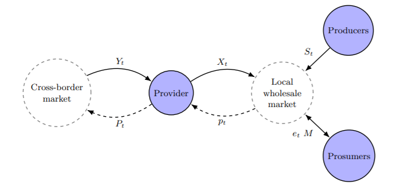

# Trophic resilience and prosumer electricity markets

Exploratory code for a (hopefully) upcoming paper on trophic resilience applied to industry networks.

It requires `Julia v1.5.2`. 

--- 

> "Macroeconomic resilience has two components:  instantaneous resilience, which is the ability to limit the magnitude of immediate production losses for a given amount of asset losses, and dynamic resilience, which is the ability to reconstruct and recover" - Hallegatte, (2014)

The idea is to analyze electricity prosumer markets using trophic analysis. 

Code and proposal is ever-changing. 
