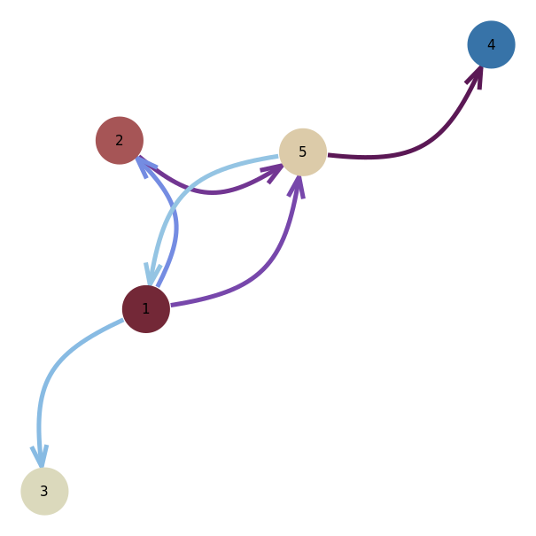
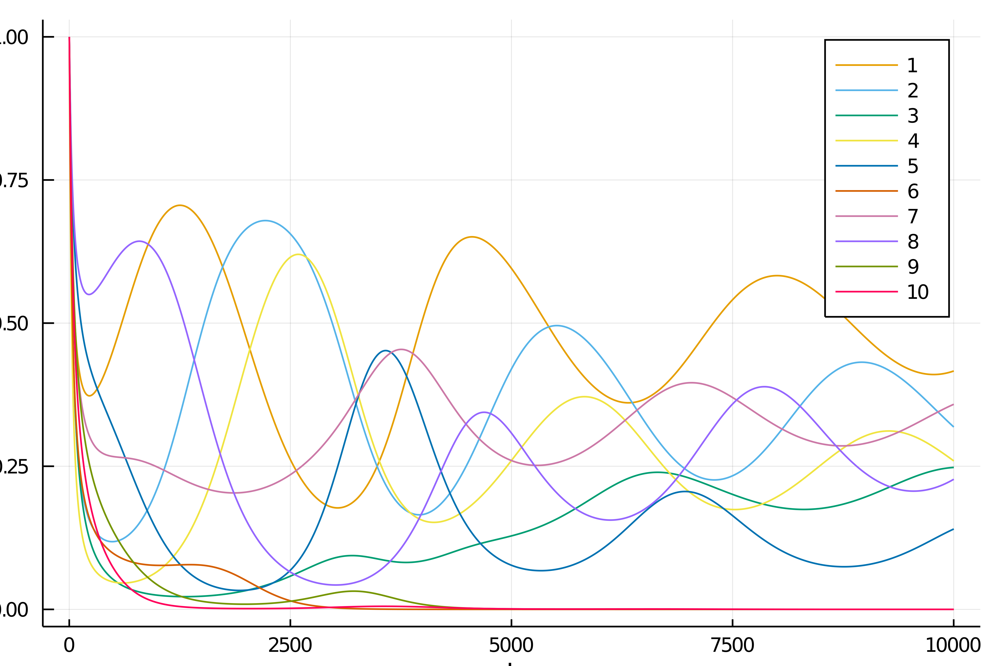

# Trophic resilience



Exploratory code for a (hopefully) upcoming paper on trophic resilience applied to industry networks.

It requires `python3.8`. Use an environment and run

```bash
pip install -r requirements.txt
```

--- 

> "Macroeconomic resilience has two components:  instantaneous resilience, which is the ability to limit the magnitude of immediate production losses for a given amount of asset losses, and dynamic resilience, which is the ability to reconstruct and recover" - Hallegatte, (2014)

